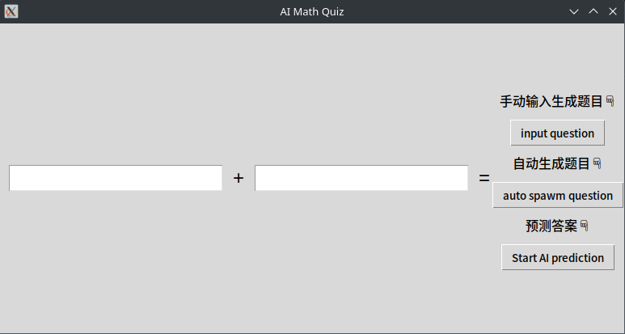

# AI Math Quiz
[点击这里跳转中文版本README](./README_Chinese.md)
## Project Overview

AI Math Quiz is an interactive math quiz application based on Python, integrating the Tkinter graphical user interface and PyTorch neural networks. Users can manually input addition problems or let the program automatically generate problems involving both addition and subtraction. The answers to these problems are then predicted using a pre-trained neural network model.

### Key Features
- Manually input addition problems

- Automatically generate problems involving addition and subtraction

- Utilize a pre-trained neural network model for answer prediction

- Display a comparison between the correct answer and the predicted answer

### Installation Steps

Before running this project, you need to install the necessary dependencies. You can use the following command to install them:

```commandline
pip install torch numpy
```
**Ensure that your Python environment has Tkinter installed.**

## Usage
Here's a glimpse of the interface 👇



In the interface above, you can choose to **Automatically Generate** problems or **Manually Input** them. It's incredibly user-friendly. Simply click **Predict Answer** to proceed.

## Note
The model has already been pre-trained and can be used directly without the need for further training. If you wish to train the model, please refer to the `train.py` file.