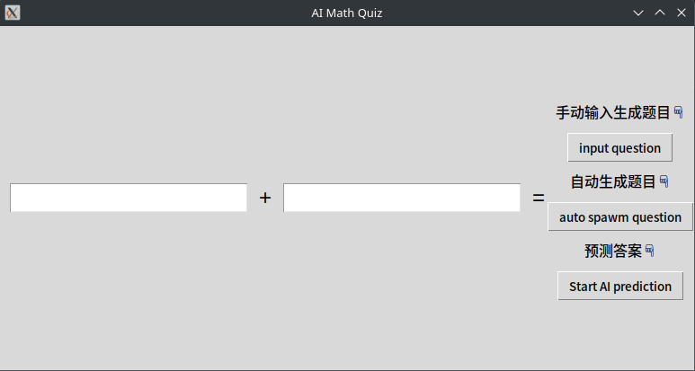

# 自动计算加减法

## 项目概述

AI Math Quiz 是一个基于 Python 的交互式数学问答应用程序，结合了 Tkinter 图形用户界面和 PyTorch 神经网络。用户可以手动输入加法题目或让程序自动生成包含加法和减法的题目，然后使用预训练的神经网络模型预测题目的答案。

### 功能特性
- 手动输入生成加法题目

- 自动生成包含加法和减法的题目

- 使用预训练的神经网络模型进行答案预测

- 显示正确答案和预测答案的对比

### 安装步骤

在运行此项目之前，您需要安装必要的依赖库。可以使用以下命令进行安装：

```commandline
pip install torch numpy
```
**确保您的python有tkinter。**
## 方法
这里是弹出的窗口👇



在👆里，可以选择**自动生成**还是**手动输入**，特别方便，再点击**预测答案**

##说明
已经训练好了模型，所以可以直接使用，无需训练，若需要训练，请前往train.py文件训练。

我首先开源到gitee,在https://gitee.com/imjumpinghouge/calculate-ai
